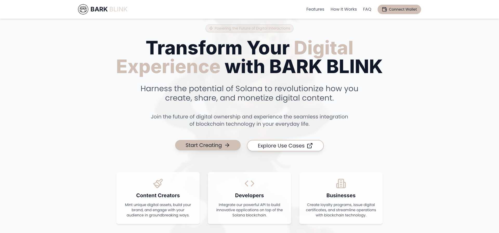
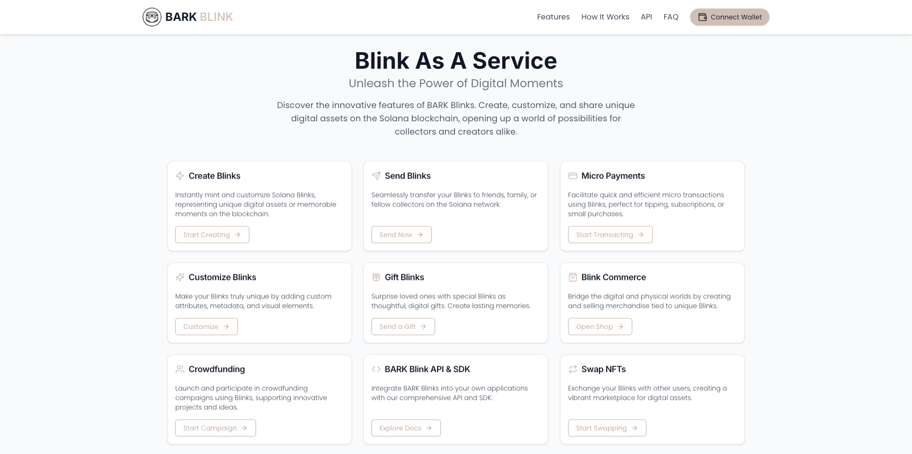
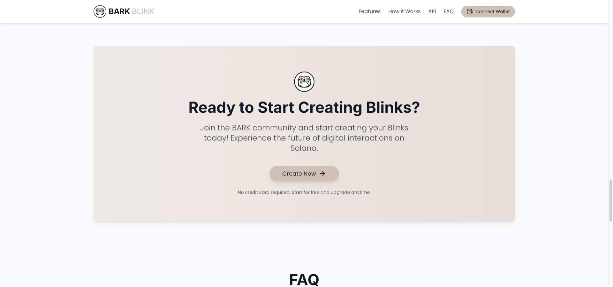
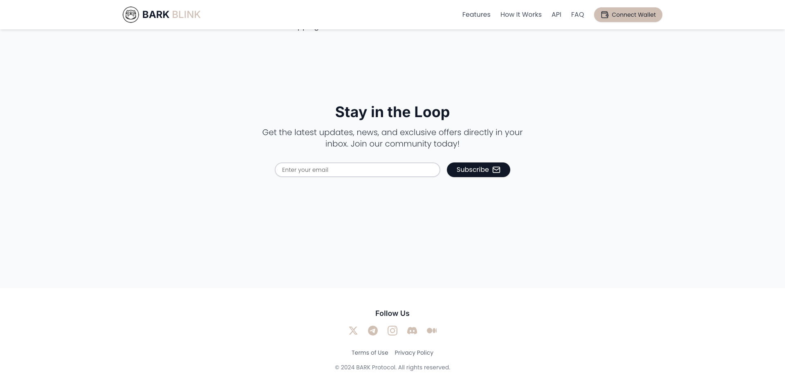

# BARK - BLINK As A Service Application

Welcome to the BARK - BLINKS project! This repository contains the frontend code for the BARK Protocol's Blinks As A Service platform, built using Next.js, React, and Tailwind CSS.

## Table of Contents

- [Overview](#overview)
- [Features](#features)
- [Blinkboard (Dashboard)](#blinkboard)
- [Web Interface and Logic](#web-interface-and-logic)
- [Screenshots](#screenshots)
- [Getting Started](#getting-started)
- [Project Structure](#project-structure)
- [Technologies Used](#technologies-used)
- [Contributing](#contributing)
- [License](#license)
- [Contact](#contact)

## Overview

BARK Blink is a streamlined decentralized application (dApp) for managing token interactions on the Solana blockchain to create, manage, and trade digital assets called Blinks. This web interface provides users with an intuitive and seamless experience to interact with the BARK Protocol. Blink As A Service platform enables users to easily create, transfer, and manage SPL tokens, NFTs, airdrops, and on-chain transactions with a simple, user-friendly interface. Built for seamless interaction with Solana's infrastructure, BARK Blink simplifies the process of sending digital assets, performing airdrops, enabling them to participate in the future of digital interactions and asset management, and managing wallet-to-wallet transactions.

## Features

- Create and customize Solana Blinks with unique attributes
- Manage your Blink collection in a user-friendly dashboard
- Trade Blinks on supported marketplaces
- Integrated token swapping for efficient asset management
- Secure wallet connection for safe transactions
- Real-time updates and notifications
- Comprehensive analytics and portfolio tracking
- Social sharing capabilities for Blinks

## Blinkboard (Dashboard)

Blinkboard is the central hub of the BARK - BLINKS platform. It provides users with a comprehensive overview and management interface for their Blinks and related activities.

Key features of Blinkboard include:

- Real-time portfolio tracking and valuation of Blinks
- Blink creation and customization tools for unique NFTs
- Detailed transaction history and comprehensive analytics
- Integrated marketplace support for trading Blinks
- Staking and reward management for maximizing value
- Personalized user profile and settings customization
- Real-time activity feed and social interactions
- Notification center for important updates and changes

The Blinkboard dashboard https://github.com/barkprotocol/blinkboard is designed to be intuitive and easy to use, offering both casual users and advanced traders a seamless experience with their digital assets.

## Web Interface

The Web Interface of BARK - BLINKS is built using Next.js and React for dynamic and responsive user interactions. Tailwind CSS powers the design for rapid and modern UI development. Key logic and functionalities include:

- **Wallet Integration:** Supports various Solana wallets (Phantom, Solflare, Backpack) through `@solana/wallet-adapter-react` for secure and fast transactions.
- **API Communication:** The web interface communicates with BARK's backend via REST APIs for Blink creation, transfer, and marketplace interactions.
- **On-Chain Operations:** The frontend interacts with Solana programs via `@solana/web3.js` to create SPL tokens, mint NFTs, perform transfers, and swap tokens.
- **State Management:** Utilizes React hooks and context to manage wallet connections, user sessions, and real-time updates across the Blinkboard.
- **Analytics & Notifications:** Provides real-time updates on portfolio value, staking rewards, and a history of all transactions in the system.

The interface also includes integrated support for **Prisma** to handle database interactions, which makes tracking Blink metadata and user portfolios efficient and secure.

## Screenshots

### Hero Section


### Features


### How It Works


### Call to Action


### FAQ


### Newsletter


## Getting Started

To get started with the BARK - BLINKS Web UI, follow these steps:

### Prerequisites

- Node.js (v18 or later)
- pnpm or yarn
- Solana CLI (for local development)

### Web DApp Installation

1. Clone the repository:
   ```bash
   git clone https://github.com/barkprotocol/blinks-as-a-service-dapp.git
```

2. Install dependencies:

```shellscript
pnpm install
```

or

```shellscript
yarn install
```

3. Set up environment variables:
Create a `.env.local` file in the root directory and add the following variables:

```shellscript
NEXT_PUBLIC_RPC_ENDPOINT=your_solana_rpc_endpoint
NEXT_PUBLIC_NETWORK=mainnet-beta
```

4. Run the development server:

```shellscript
pnpm run dev
```

or

```shellscript
yarn dev
```

5. Open [http://localhost:3000](http://localhost:3000) in your browser to see the application.


## Usage

1. Connect your Solana wallet to BARK BLINKS.
2. Use the intuitive interface to create and customize your Solana Blinks.
3. Send your Blinks to friends or trade them on supported marketplaces.
4. Track and manage your Blinks in your personal Blinkboard.
5. Create SPL tokens and manage your token portfolio.
6. Swap tokens using the integrated decentralized exchange functionality.


## Prisma

To use this updated schema:

1. Replace the contents of your `schema.prisma` file with the latest schema.
2. Run `npx prisma generate` to update the Prisma client.
3. Run `npx prisma db push` to apply these changes to your development database (or use migrations for production environments).


## API Routes (under construction)

The application includes several API routes for interacting with the Solana blockchain:

- `/api/v1/create-blink`: Create a new Solana Blink
- `/api/v1/send-blink`: Transfer a Blink to another user
- `/api/v1/get-user-blinks`: Retrieve a user's Blink collection
- `/api/v1/create-spl-token`: Create a new SPL token
- `/api/v1/swap-tokens`: Perform a token swap


For detailed information on how to use these API routes, please refer to the API documentation.

## Contributing

We welcome contributions to BARK BLINK! Please follow these steps to contribute:

1. Fork the repository
2. Create a new branch (`git checkout -b feature/NewFeature`)
3. Make your changes
4. Commit your changes (`git commit -m 'Add some NewFeature'`)
5. Push to the branch (`git push origin feature/NewFeature`)
6. Open a Pull Request

Please make sure to update tests as appropriate and adhere to the [Contributor Covenant](https://www.contributor-covenant.org/) code of conduct.


## To-Do List

### 1. **Implement Blinkboard Functions and Integrations**
   - Integrate **Blinkboard** features across dApps, plugins, widgets, and websites for seamless interactions.
   - Add **launch buttons** to open the app or navigate to the website efficiently.

### 2. **Create Modular Applications**
   - Design and build **modular applications** that support scalability and easy maintenance.
   - Organize project structure by creating separate **frontend**, **API**, and **backend** folders.
   - Ensure **code reusability** to streamline development across different modules.

### 3. **API Development**
   - Develop **secure and efficient APIs** for Blinkboard and other external integrations.
   - Optimize API logic with a focus on **performance** and **scalability**.

### 4. **Remove Unnecessary Files and Folders**
   - Audit the project directory and **remove redundant files** and **folders** that are no longer needed.
   - Ensure the project is lean and maintainable by eliminating obsolete resources.

### 5. **Create API and Platform Documentation**
   - Write clear and comprehensive **API documentation** for developers, including endpoints, request/response structures, and authentication details.
   - Create detailed **platform documentation** covering the architecture, modules, and user workflows to help onboard new team members or partners.
   - Include examples, code snippets, and integration guides for ease of use.


## License

This project is licensed under the MIT License. See the [LICENSE](LICENSE) file for details.

## Acknowledgements

- [Solana](https://solana.com/)
- [Next.js](https://nextjs.org/)
- [React](https://reactjs.org/)
- [Tailwind CSS](https://tailwindcss.com/)
- [shadcn/ui](https://ui.shadcn.com/)
- [@solana/web3.js](https://github.com/solana-labs/solana-web3.js)
- [@solana/spl-token](https://github.com/solana-labs/solana-program-library/tree/master/token)
- [Anchor Framework](https://www.anchor-lang.com/)
```